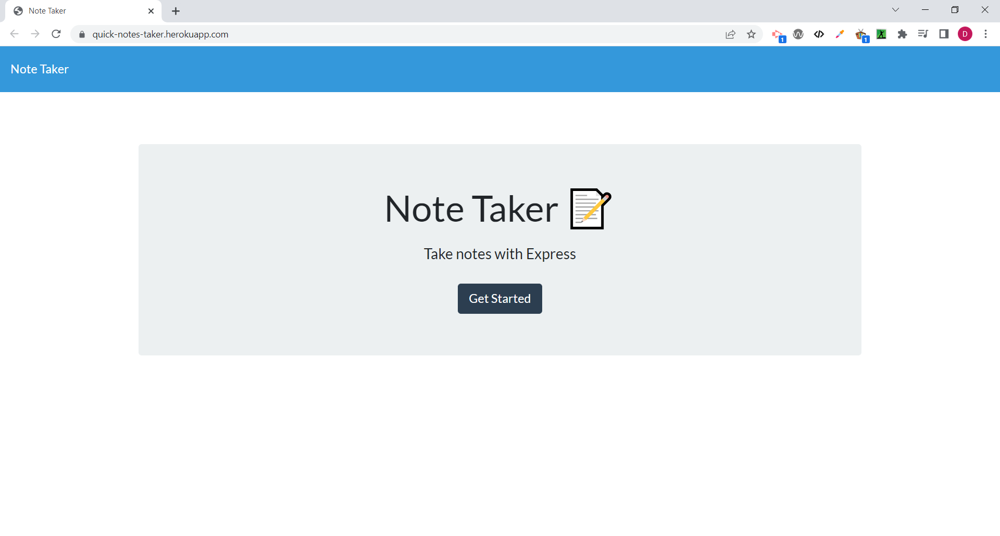
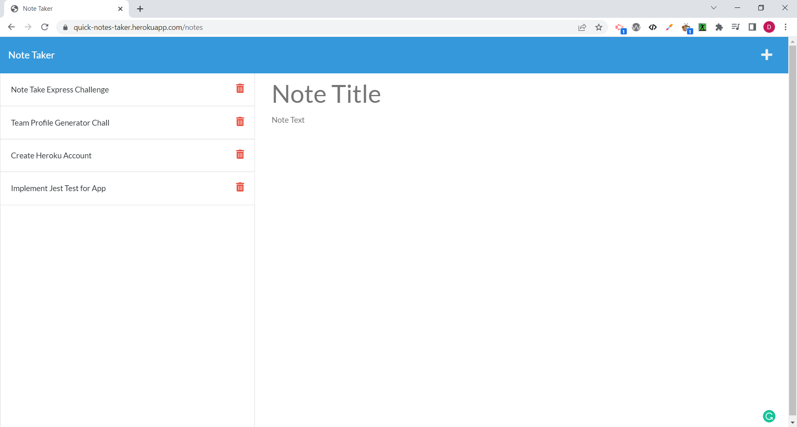

# Quick Notes Taker

[](https://choosealicense.com/licenses/mit)
[](https://deepscan.io/dashboard#view=project&tid=19657&pid=23147&bid=692462)
## Description   
<p>
This web application provides the user the ability to quickly create notes, update and delete notes and to store them in a cloud server when they can be accesed from anywhere.
</p>

<p><strong>🎥Click on video to view🎥</strong></p>

<a href="https://drive.google.com/file/d/1qTWG7uddcVcrCi7xVT3yNl4vStEt5ZMf/view?usp=share_link" target="_blank">
</img>
</a>

Download Video in <a href="./public/images/video.webm">webm</a> or <a href="./public/images/video.mp4">mp4</a>

## Table of contents

  * [Description](#description)
  * [Installation](#🛠️installation)
  * [Usage](#💻usage)
  * [Dependencies](#🧩dependencies)
  * [License](#📛license)
  * [Contributing](#🤝contributing)
  * [Tests](#📃tests)
  * [Questions](#❓questions)
  * [Website](#🌐website)
  * [Programming Languages](#👨‍💻programming-languages)
  * [Credits](#👨creadits)

## 🛠️Installation    
<p>To install the application clone the repository https://github.com/danielfloresd/quick-notes-taker and run node package manager with the following command: <strong>npm i</strong>    
</p>      
<!--  -->


## 💻Usage    

<p>After installing all dependencies run <strong>node server.js or npm start</strong>. The application can be accessed from the web browser locally by opening http://localhost:3001/
</p>

To use the live web app in heroku, please visit the [Quick Notes Taker](https://quick-notes-taker.herokuapp.com/)  
  

  

## 🧩Dependencies   
* [Express.js](https://www.npmjs.com/package/express)
* [Jest](https://www.npmjs.com/package/jest)
* [Bootstrap](https://getbootstrap.com/)

## 📛License    
Project license: [MIT](https://choosealicense.com/licenses/mit).     

<details><summary><b>View License</b></summary>MIT License

Copyright (c) 2022 Daniel Flores D

Permission is hereby granted, free of charge, to any person obtaining a copy
of this software and associated documentation files (the "Software"), to deal
in the Software without restriction, including without limitation the rights
to use, copy, modify, merge, publish, distribute, sublicense, and/or sell
copies of the Software, and to permit persons to whom the Software is
furnished to do so, subject to the following conditions:

The above copyright notice and this permission notice shall be included in all
copies or substantial portions of the Software.

THE SOFTWARE IS PROVIDED "AS IS", WITHOUT WARRANTY OF ANY KIND, EXPRESS OR
IMPLIED, INCLUDING BUT NOT LIMITED TO THE WARRANTIES OF MERCHANTABILITY,
FITNESS FOR A PARTICULAR PURPOSE AND NONINFRINGEMENT. IN NO EVENT SHALL THE
AUTHORS OR COPYRIGHT HOLDERS BE LIABLE FOR ANY CLAIM, DAMAGES OR OTHER
LIABILITY, WHETHER IN AN ACTION OF CONTRACT, TORT OR OTHERWISE, ARISING FROM,
OUT OF OR IN CONNECTION WITH THE SOFTWARE OR THE USE OR OTHER DEALINGS IN THE
SOFTWARE.
</details></br>   
       
## 🤝Contributing 

If you would like to contribute, please follow the [GitHub contribution guidelines](https://github.com/github/docs/blob/main/CONTRIBUTING.md)   
      
## 📃Tests  
Testing implemented using jest. To run unit testing <strong>npm test</strong>


## ❓Questions   
<p> 
Question 1: Does the application support additional styling? Yes, the style can be customized in the style.css file.
</p>

For additional questions, please contact:

* [](https://github.com/danielfloresd)   
* [](mailto:daniel.flor3s.d@gmail.com)    
        
## 🌐Website    
To use the live web app, please visit the [Quick Notes Taker](https://quick-notes-taker.herokuapp.com/)  

## 👨‍💻Programming Languages    
This project was created with: HTML, CSS, and JavaScript   

## 👨Credits


<!-- ## User Story

```
AS A small business owner
I WANT to be able to write and save notes
SO THAT I can organize my thoughts and keep track of tasks I need to complete
```


## Acceptance Criteria

```
GIVEN a note-taking application
WHEN I open the Note Taker
THEN I am presented with a landing page with a link to a notes page
WHEN I click on the link to the notes page
THEN I am presented with a page with existing notes listed in the left-hand column, plus empty fields to enter a new note title and the note’s text in the right-hand column
WHEN I enter a new note title and the note’s text
THEN a Save icon appears in the navigation at the top of the page
WHEN I click on the Save icon
THEN the new note I have entered is saved and appears in the left-hand column with the other existing notes
WHEN I click on an existing note in the list in the left-hand column
THEN that note appears in the right-hand column
WHEN I click on the Write icon in the navigation at the top of the page
THEN I am presented with empty fields to enter a new note title and the note’s text in the right-hand column
``` -->
